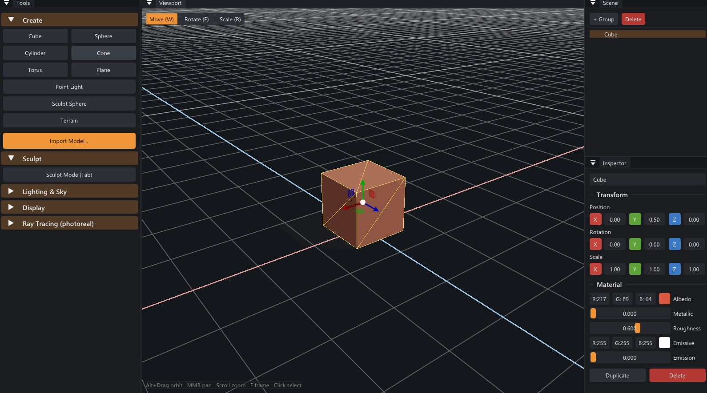

<div align="center">

<pre>
███████╗ ██████╗ ██████╗  ██████╗ ███████╗
██╔════╝██╔═══██╗██╔══██╗██╔════╝ ██╔════╝
█████╗  ██║   ██║██████╔╝██║  ███╗█████╗
██╔══╝  ██║   ██║██╔══██╗██║   ██║██╔══╝
██║     ╚██████╔╝██║  ██║╚██████╔╝███████╗
╚═╝      ╚═════╝ ╚═╝  ╚═╝ ╚═════╝ ╚══════╝
</pre>

### **A Simple 3D Engine & Editor**

*Forge primitives. Import worlds. Trace light.*

[](https://github.com/Maxim-Mushizky/forge-3d-engine/actions/workflows/ci.yml)
[](LICENSE)
[](https://en.cppreference.com/w/cpp/20)
[](https://www.opengl.org/)
[](#build--run)
[](CMakeLists.txt)

</div>

---

Forge is a small but real-time 3D engine with an integrated editor, written in modern
C++20 on top of OpenGL 4.6. It can place primitives, import free glTF/OBJ assets, edit a
scene with gizmos and an inspector, shade it from flat through PBR, and flip into a
progressive **GPU path-traced** render mode implemented as an OpenGL compute shader.

> **Status:** in development. See [`docs/PLAN.md`](docs/PLAN.md) for the full architecture
> plan and [`docs/PLAN-M8-MODELING.md`](docs/PLAN-M8-MODELING.md) for the modeling roadmap.

<div align="center">



<sub><i>The Forge editor — dockable viewport, hierarchy, and inspector panels.</i></sub>

</div>

---

## Features

- **Scene editing** — place cube / sphere / plane / cylinder / cone / torus primitives,
  select by click, translate/rotate/scale with on-screen gizmos, edit via an inspector
  sidebar, full undo/redo.
- **Asset import** — glTF 2.0 and OBJ (the formats CC0 libraries like Kenney.nl and
  PolyHaven ship), via header-only `tinygltf` / `tinyobjloader`.
- **Shading** — flat → Blinn-Phong → PBR (metallic/roughness), plus a directional shadow map.
- **Ray tracing** — toggle a progressive path tracer (BVH traversal, lambertian + metallic
  BRDFs, emissive lights, hard shadows) running entirely in a GL compute shader — no
  Vulkan/DXR required, runs on any GL 4.3+ GPU.
- **Dockable editor UI** — Dear ImGui (docking branch) with viewport, hierarchy, inspector,
  and toolbox panels.

## Tech stack

| Concern        | Choice                                  |
|----------------|-----------------------------------------|
| Language       | C++20                                   |
| Build          | CMake 3.29 + Ninja, deps via FetchContent |
| Compiler       | MinGW-w64 GCC 13.2                       |
| Window / input | GLFW 3.4                                |
| Graphics API   | OpenGL 4.6 core                         |
| GL loader      | GLEW (glew-cmake)                       |
| UI / gizmos    | Dear ImGui (docking) + ImGuizmo         |
| Math           | GLM                                     |
| Asset import   | tinygltf + tinyobjloader + stb_image    |
| Scene files    | nlohmann/json                           |

All dependencies are fetched and built automatically at configure time — nothing to install
manually beyond the toolchain.

## Project layout

```
3d-engine/
├── CMakeLists.txt        # root: options, FetchContent deps
├── CMakePresets.json     # mingw-debug / mingw-release
├── run.ps1               # configure + build + launch one-liner
├── docs/                 # architecture & milestone plans
├── engine/               # static lib `forge` (core/platform/renderer/scene/assets/raytrace)
├── editor/               # exe `ForgeEditor` (app, camera, panels, command stack)
└── assets/               # shaders, models, HDRIs
```

## Build & run

Requirements: GCC 13.2 (MinGW-w64), CMake 3.29, Ninja 1.12, Git — on Windows 11 x64.

```powershell
# configure + build (FetchContent downloads deps on first configure)
cmake --preset mingw-release
cmake --build --preset mingw-release
.\build\release\editor\ForgeEditor.exe

# or the one-liner
.\run.ps1                 # debug:  .\run.ps1 -Config debug
```

## Contributing

Contributions welcome. Read [`CONTRIBUTING.md`](CONTRIBUTING.md) first — it covers the build,
the house style (naming, class structure, RAII/ownership), the mandatory logging policy, and
the error-handling rules.

## License

Released under the [MIT License](LICENSE). © 2026 Maxim Mushizky.
